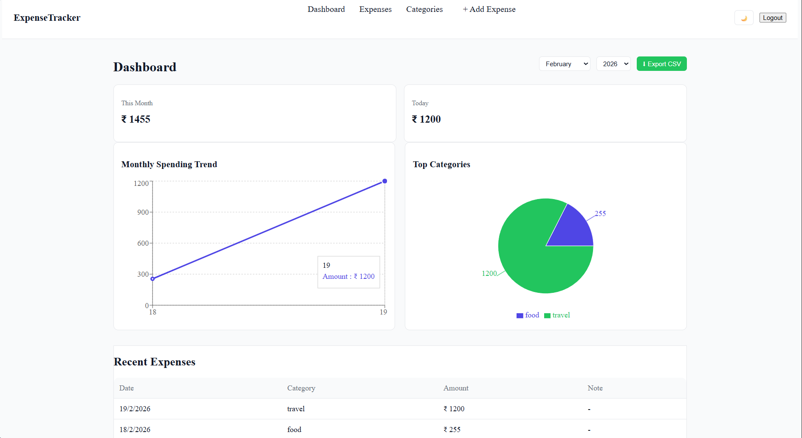
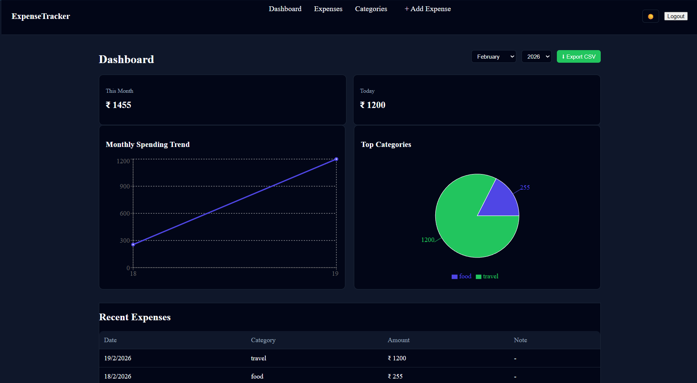
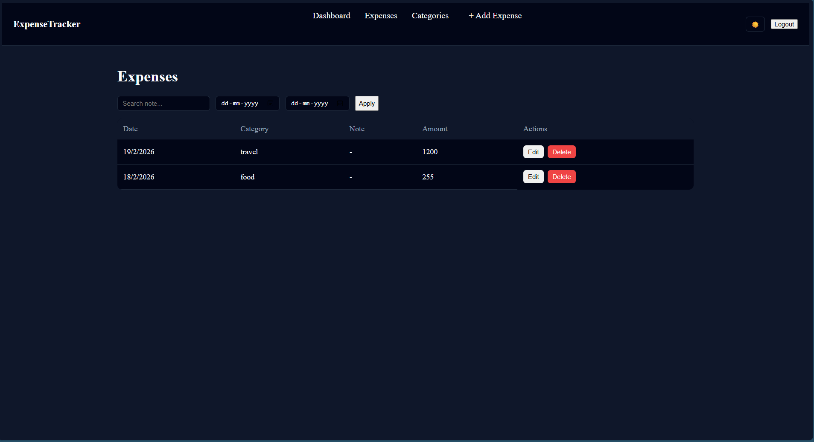
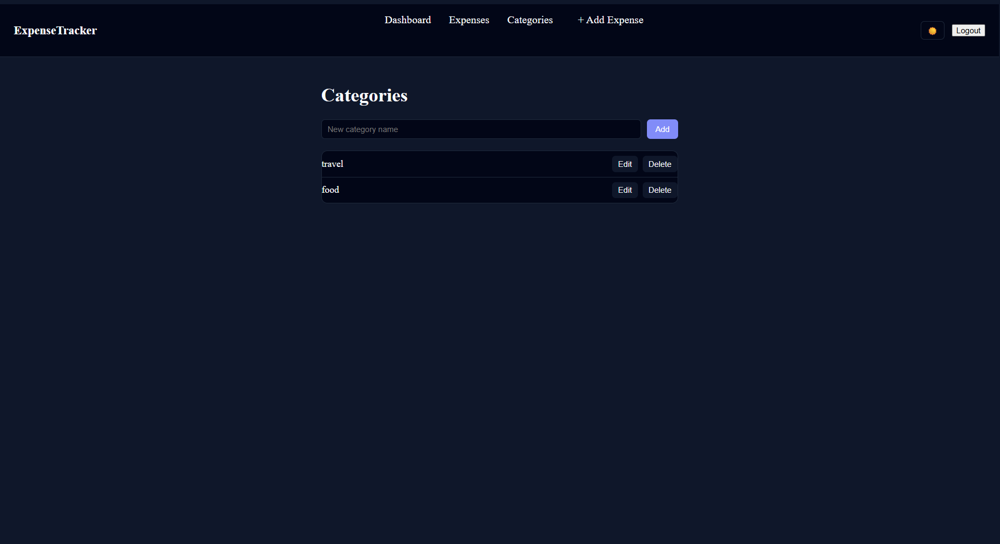

# 💸 Expense Tracker (MERN Stack)

A full-stack Expense Tracker application built using the **MERN stack** with secure authentication, category-based expense management, interactive dashboard, charts, CSV export, and dark/light theme support.

This project focuses on **real-world backend + frontend architecture**, clean UX, and production-ready practices.

---

## 🚀 Features

### 🔐 Authentication
- User registration & login
- JWT authentication using **httpOnly cookies**
- Access token + refresh token flow
- Protected routes (frontend & backend)

### 📊 Dashboard
- Monthly & daily expense summary
- Category-wise expense breakdown (Pie Chart)
- Monthly expense trend (Bar / Line Chart)
- Recent expenses list
- Month & year filter
- CSV export for expenses

### 🧾 Expenses
- Create, update, delete expenses
- Category selection (mandatory)
- Search, filter, pagination
- Edit expenses via modal
- Validation on both frontend & backend

### 🏷 Categories
- Create, update, delete categories
- Prevent deletion if category is used by expenses
- User-specific categories

### 🎨 UI / UX
- Clean & modern UI
- Dark / Light theme toggle
- Responsive layout
- Empty & loading states
- Error boundaries

---

## 🛠 Tech Stack

### Frontend
- React
- React Router
- Context API
- Axios (with interceptors)
- Chart.js / Recharts
- CSS (component-scoped)
- react-hot-toast

### Backend
- Node.js
- Express.js
- MongoDB + Mongoose
- JWT
- Joi validation
- Cookie-based auth
- MVC architecture

---

## 🗂 Folder Structure

### Backend
backend/
├─ controllers/
├─ models/
├─ routes/
├─ middlewares/
├─ validations/
├─ config/
└─ server.js


### Frontend
frontend/
├─ api/
├─ components/
├─ pages/
├─ context/
├─ layouts/
├─ styles/
└─ App.jsx


---

## 🧪 Environment Variables

### Backend (.env)
```env
PORT=5000
MONGO_URI=your_mongodb_url

JWT_ACCESS_TOKEN_SECRET=your_secret
JWT_REFRESH_TOKEN_SECRET=your_secret
JWT_ACCESS_TOKEN_EXPIRATION=1d
JWT_REFRESH_TOKEN_EXPIRATION=7d

NODE_ENV=development

▶️ Run Locally
Backend

cd backend
npm install
npm run dev

Frontend

cd frontend
npm install
npm run dev

📸 Screenshots
## 📸 Screenshots

### 🔐 Authentication


---

### 📊 Dashboard (Light & Dark Mode)



---

### 🧾 Expense Management



---

### 🏷 Category Management



🔒 Security Practices

JWT stored in httpOnly cookies (prevents XSS)

Refresh token rotation

Backend authorization checks for every resource

Validation middleware (Joi)

Protected frontend routes

📈 What I Learned

Designing scalable REST APIs

Secure authentication flows

Frontend-backend integration

State management with Context API

Building dashboards with charts

Handling real-world edge cases

Writing production-ready code

📌 Future Improvements

PDF export

User profile & avatar

Budget limits

Notifications

Deployment with CI/CD

👨‍💻 Author

Kalpesh Pagar
Final-year Engineering Student
